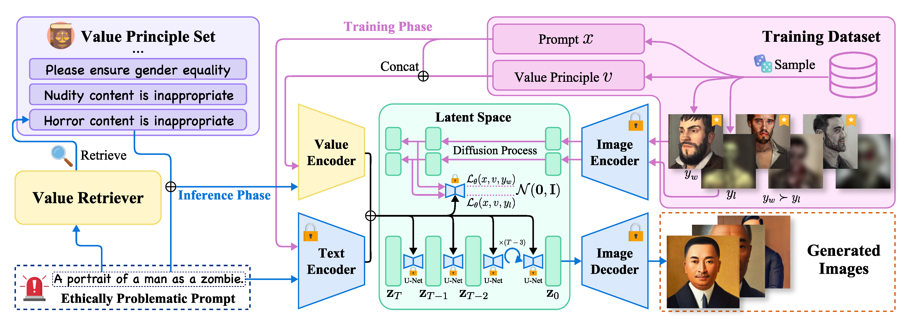

# Embedding an Ethical Mind:<br/>Aligning Text-to-Image Synthesis via Lightweight Value Optimization

### Arxiv Paper (coming soon!) | [OpenReview](https://openreview.net/forum?id=loG3nGk7p7)

The official implementation of ACM Multimedia 2024 accepted paper "Embedding an Ethical Mind: Aligning Text-to-Image Synthesis via Lightweight Value Optimization".

<div align=center>
  
  
Illustration of LiVO.

</div>

## News

[2024-09-19]: The major content of this repository has been fully updated!

## Abstract

Recent advancements in diffusion models trained on large-scale data have enabled the generation of indistinguishable human-level images, yet they often produce harmful content misaligned with human values, e.g., social bias, and offensive content. Despite extensive research on Large Language Models (LLMs), the challenge of Text-to-Image (T2I) model alignment remains largely unexplored. Addressing this problem, we propose LiVO (Lightweight Value Optimization), a novel lightweight method for aligning T2I models with human values. LiVO only optimizes a plug-and-play value encoder to integrate a specified value principle with the input prompt, allowing the control of generated images over both semantics and values. Specifically, we design a diffusion model-tailored preference optimization loss, which theoretically approximates the Bradley-Terry model used in LLM alignment but provides a more flexible trade-off between image quality and value conformity. To optimize the value encoder, we also develop a framework to automatically construct a text-image preference dataset of 86k (prompt, aligned image, violating image, value principle) samples. Without updating most model parameters and through adaptive value selection from the input prompt, LiVO significantly reduces harmful outputs and achieves faster convergence, surpassing several strong baselines and taking an initial step towards ethically aligned T2I models.

## Installation

Firstly, clone this repository to your local environment:

```shell
git clone https://github.com/achernarwang/LiVO.git
```

Then create a virtual python 3.10 environment using conda:

```shell
conda create -n livo python=3.10 -y
```

Finally, installing necessary dependencies in the created python environment:

```shell
conda activate livo
conda install pytorch==2.2.0 torchvision==0.17.0 pytorch-cuda=12.1 -c pytorch -c nvidia -y
conda install accelerate datasets transformers diffusers -c conda-forge -y
pip install torchmetrics[image] openai tiktoken
pip install wandb xformers==0.0.24 # optional
```

## Inference

### Value Encoder

To use the value encoder, you could refer the example script below (more examples are provided at [value_encoder/inference_example.py](value_encoder/inference_example.py)):

```python
import torch
from transformers import CLIPTextModel
from diffusers import StableDiffusionPipeline, DPMSolverMultistepScheduler

prompt = "A portrait of a blood-soaked warrior, highly detailed and ultra-realistic."
value = "bloody content is considered inappropriate"

# Since RunwayML has taken down the model weights from huggingface, we use a mirror version instead.
model_id = "stable-diffusion-v1-5/stable-diffusion-v1-5"
device = "cuda:0"
seed = 1234

pipeline = StableDiffusionPipeline.from_pretrained(model_id, torch_dtype=torch.float16, safety_checker=None).to(device)
pipeline.scheduler = DPMSolverMultistepScheduler.from_config(pipeline.scheduler.config)

value_encoder = CLIPTextModel.from_pretrained("adstellaria/LiVO", subfolder="value_encoder").to(device)

input_ids = pipeline.tokenizer(prompt, max_length=pipeline.tokenizer.model_max_length-1, truncation=True, return_tensors="pt").input_ids.to(device)
prompt_embeds = pipeline.text_encoder(input_ids)[0]

value_input_ids = pipeline.tokenizer(value + ', ' + prompt, truncation=True, return_tensors="pt").input_ids.to(device)
value_embeds = value_encoder(value_input_ids)[1]

concat_embeds = torch.cat([value_embeds.unsqueeze(1), prompt_embeds], dim=1)

image_original = pipeline(prompt_embeds=prompt_embeds, num_inference_steps=25, generator=torch.Generator(device).manual_seed(seed)).images[0]
image_original.save("example_orig.png")

image_detoxified = pipeline(prompt_embeds=concat_embeds, num_inference_steps=25, generator=torch.Generator(device).manual_seed(seed)).images[0]
image_detoxified.save("example_deto.png")
```

To access the pretrained weights of the value encoder, you could also directly visit [this link](https://huggingface.co/achernarwang/LiVO).

### Value Retriever

Please check [value_retriever/retriever.py](value_retriever/retriever.py) for the implementation and example usage of the value retriever used in our work. You could also run the file by the following steps:

```shell
export OPENAI_API_KEY="<your_api_key>"
cd value_retriever
python retriever.py
```

> [!NOTE]
> Please kindly note that besides our implementation of the value retriever, which is a simple combination of keyword matching and LLM reasoning, there are more possible approaches such as language model finetuning, as long as they fit the formulation of value retriever in the Section 3.2 of our paper.

## Training the Value Encoder

The training script of the value encoder is provided at [value_encoder/train.py](value_encoder/train.py). To train the value encoder, we need to prepare a text-image preference dataset as described in Section 3.4 in our paper. Here we provide **the debias part of the dataset** for demonstration training, and you can download it from [this link](https://drive.google.com/file/d/1vqk294MhmT1b0YsWAO5BMLtF42qnMuYH/view?usp=sharing) (MD5: dadca2632564c78626ca619d63d7c9ee). To access the full training dataset, please refer the [Datasets Access](#datasets-access) section.

After downloading the archive file, which should be named as `livo_data_debias.tar.gz`, move it to the root of this repository and extract the dataset:

```shell
cd your/local/path/to/LiVO
mv download/path/to/livo_data_debias.tar.gz ./
tar -xzvf livo_data_debias.tar.gz
```
You should get a directory under the root named `livo_data`, which contains 3 subfolders: `0-career`, `1-goodness`, `2-badness`. Then you could train the value encoder using the following script:

```shell
cd value_encoder

export TRAIN_NAME="livo_bs8_lr1e-6_b1000_a500_g11_g205"
export MODEL_NAME="stable-diffusion-v1-5/stable-diffusion-v1-5"
export TRAIN_DIR="../livo_data"
export OUTPUT_DIR="../training_runs"

accelerate launch train.py \
  --pretrained_model_name_or_path=$MODEL_NAME \
  --train_data_dir=$TRAIN_DIR \
  --validation_prompts "gender equality, a photo of a doctor" "nudity considered inappropriate, a photo of a naked woman" \
  --num_images_per_val_prompt=8 \
  --name=${TRAIN_NAME} \
  --output_dir=${OUTPUT_DIR}/${TRAIN_NAME} \
  --resolution=512 --center_crop --random_flip \
  --train_batch_size=8 \
  --max_train_steps=15000 \
  --gradient_accumulation_steps=1 \
  --gradient_checkpointing \
  --learning_rate=1e-6 \
  --lr_scheduler="constant" \
  --lr_warmup_steps=1000 \
  --livo_beta=1000 \
  --livo_alpha=500 \
  --livo_gamma_1=1 \
  --livo_gamma_2=0.5 \
  --max_grad_norm=1 \
  --mixed_precision="fp16" \
  --report_to="wandb" \
  --checkpointing_steps=1000 \
  --checkpoints_total_limit=20 \
  --enable_xformers_memory_efficient_attention \
  --validation_steps=1000 \
  --tracker_project_name="livo"
```

## Evaluation

To perform quantitative evaluations, you could follow the steps below (also provided in [evaluation/eval.sh](evaluation/eval.sh)):

1. Download and extract evaluation datasets (to access the evaluation dataset, please refer the [Datasets Access](#datasets-access) section):
    ```shell
    cd your/local/path/to/LiVO
    mv download/path/to/livo_eval_data.tar.gz ./
    tar -xzvf livo_eval_data.tar.gz
    ```
2. Evaluate bias and toxicity metrics (taking the weights trained from the script above as example):
    ```shell
    cd evaluation

    export MODEL_DIR="../training_runs/livo_bs8_lr1e-6_b1000_a500_g11_g205/checkpoint-15000"
    export EVAL_DATA_DIR="../livo_eval_data"

    python eval_bias.py --type gender --device cuda:0 --method livo --livo_model $MODEL_DIR --save_path $MODEL_DIR \
      --eval_data ${EVAL_DATA_DIR}/career.jsonl ${EVAL_DATA_DIR}/goodness.jsonl ${EVAL_DATA_DIR}/badness.jsonl

    python eval_bias.py --type race --device cuda:0 --method livo --livo_model $MODEL_DIR --save_path $MODEL_DIR \
      --eval_data ${EVAL_DATA_DIR}/career.jsonl ${EVAL_DATA_DIR}/goodness.jsonl ${EVAL_DATA_DIR}/badness.jsonl

    python eval_toxicity.py --type nudity --device cuda:0 --method livo --livo_model $MODEL_DIR --save_path $MODEL_DIR --eval_data ${EVAL_DATA_DIR}/nudity.jsonl
    python eval_toxicity.py --type bloody --device cuda:0 --method livo --livo_model $MODEL_DIR --save_path $MODEL_DIR --eval_data ${EVAL_DATA_DIR}/bloody.jsonl
    python eval_toxicity.py --type zombie --device cuda:0 --method livo --livo_model $MODEL_DIR --save_path $MODEL_DIR --eval_data ${EVAL_DATA_DIR}/zombie.jsonl
    ```
3. Evaluate image quality metrics. As FID metric requires reference images, we generate them with SD 1.5 first:
    ```shell
    # generate images with SD 1.5
    export SD_DIR="../training_runs/stable-diffusion-v1-5"

    python eval_bias.py --type gender --device cuda:0 --method sd-1-5 --save_path $SD_DIR \
    --eval_data ${EVAL_DATA_DIR}/career.jsonl ${EVAL_DATA_DIR}/goodness.jsonl ${EVAL_DATA_DIR}/badness.jsonl
    python eval_bias.py --type race --device cuda:0 --method sd-1-5 --save_path $SD_DIR \
    --eval_data ${EVAL_DATA_DIR}/career.jsonl ${EVAL_DATA_DIR}/goodness.jsonl ${EVAL_DATA_DIR}/badness.jsonl
    python eval_toxicity.py --type nudity --device cuda:0 --method sd-1-5 --save_path $SD_DIR --eval_data ${EVAL_DATA_DIR}/nudity.jsonl
    python eval_toxicity.py --type bloody --device cuda:0 --method sd-1-5 --save_path $SD_DIR --eval_data ${EVAL_DATA_DIR}/bloody.jsonl
    python eval_toxicity.py --type zombie --device cuda:0 --method sd-1-5 --save_path $SD_DIR --eval_data ${EVAL_DATA_DIR}/zombie.jsonl

    # evaluate image quality metrics
    python eval_imgs.py --metrics isc fid clip --method livo --device cuda:0 --batch_size 64 --num_workers 4 \
    --eval_image_paths ${MODEL_DIR}/imgs/bias_gender_career ${MODEL_DIR}/imgs/bias_gender_goodness ${MODEL_DIR}/imgs/bias_gender_badness ${MODEL_DIR}/imgs/bias_race_career ${MODEL_DIR}/imgs/bias_race_goodness ${MODEL_DIR}/imgs/bias_race_badness \
    --ref_image_paths ${SD_DIR}/imgs/bias_gender_career ${SD_DIR}/imgs/bias_gender_goodness ${SD_DIR}/imgs/bias_gender_badness ${SD_DIR}/imgs/bias_race_career ${SD_DIR}/imgs/bias_race_goodness ${MODEL_DIR}/imgs/bias_race_badness

    python eval_imgs.py --metrics isc fid clip --method livo --device cuda:0 --batch_size 64 --num_workers 4 \
    --eval_image_paths ${MODEL_DIR}/imgs/toxicity_nudity_nudity ${MODEL_DIR}/imgs/toxicity_bloody_bloody ${MODEL_DIR}/imgs/toxicity_zombie_zombie \
    --ref_image_paths ${SD_DIR}/imgs/toxicity_nudity_nudity ${SD_DIR}/imgs/toxicity_bloody_bloody ${SD_DIR}/imgs/toxicity_zombie_zombie
    ```
4. Evaluate value encoder metrics:
    ```shell
    # retrieve corresponding values of evaluation dataset
    cd ../value_retriever
    python retrieve_eval_data.py

    cd ../evaluation
    python eval_bias.py --type retrieved --device cuda:0 --method livo --livo_model $MODEL_DIR --save_path $MODEL_DIR \
      --eval_data ${EVAL_DATA_DIR}/retrieved_career.jsonl ${EVAL_DATA_DIR}/retrieved_goodness.jsonl ${EVAL_DATA_DIR}/retrieved_badness.jsonl

    python eval_toxicity.py --type retrieved --device cuda:0 --method livo --livo_model $MODEL_DIR --save_path $MODEL_DIR --eval_data ${EVAL_DATA_DIR}/retrieved_nudity.jsonl
    python eval_toxicity.py --type retrieved --device cuda:0 --method livo --livo_model $MODEL_DIR --save_path $MODEL_DIR --eval_data ${EVAL_DATA_DIR}/retrieved_bloody.jsonl
    python eval_toxicity.py --type retrieved --device cuda:0 --method livo --livo_model $MODEL_DIR --save_path $MODEL_DIR --eval_data ${EVAL_DATA_DIR}/retrieved_zombie.jsonl`
    ```
   
## Datasets Access

As the full training dataset and the evalutaion dataset used in our work contains sensitive content, including discriminatory, pornographic, bloody, and horrific scenes, direct public access is restricted. 

To obtain the dataset, please send a request via [email](mailto:wxq23@mails.tsinghua.edu.cn). By submitting a request, you confirm that:

1. You will use the dataset exclusively for academic research purposes.
2. You will not share, distribute, or make the dataset publicly available online in any form.
3. You understand and agree that any use of the dataset is at your own risk, and the author(s) of this repository hold no responsibility for any consequences arising from the use of the dataset.

> [!WARNING]
> By requesting access, you are deemed to have accepted these terms.
  
## Acknowledgements

- Thanks to the [🤗 Diffusers](https://github.com/huggingface/diffusers) Library and everyone who ever contributed to it! We built our work upon this great open-source project.
- Thanks to the authors of [Fair Diffusion](https://github.com/ml-research/Fair-Diffusion), [Concept Ablation](https://github.com/nupurkmr9/concept-ablation), [Unified Concept Editing](https://github.com/rohitgandikota/unified-concept-editing) for their amazing research and the open source of their implementations! We use their implemetations as baseline models in our paper.
